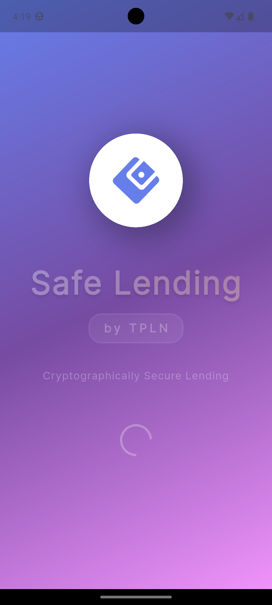
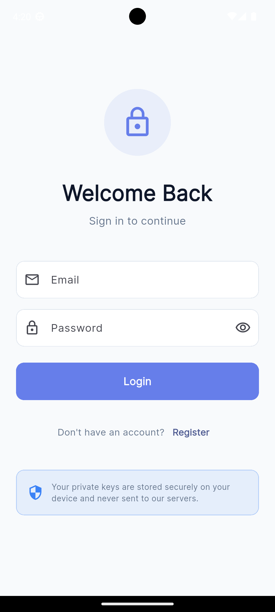
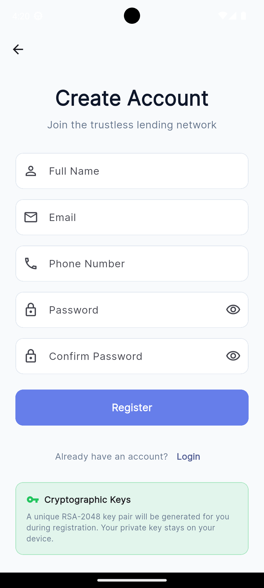
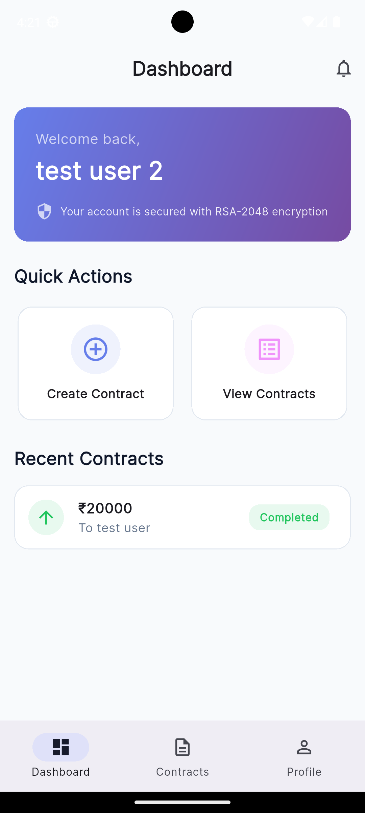
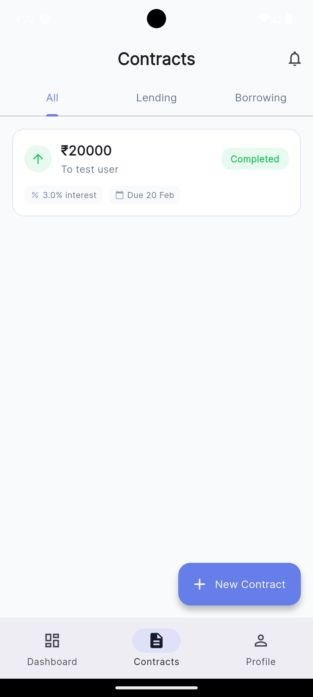
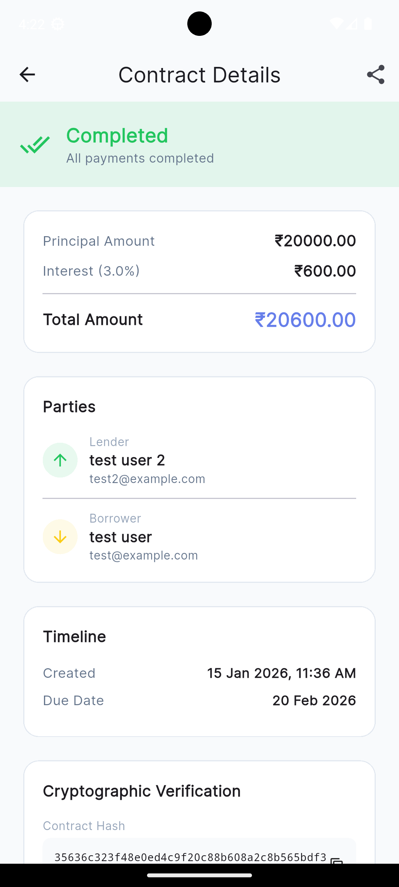
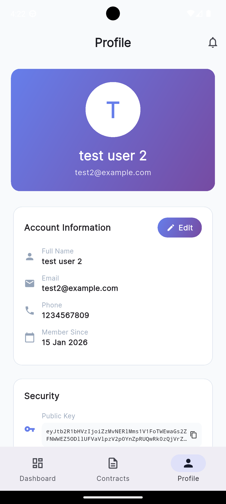
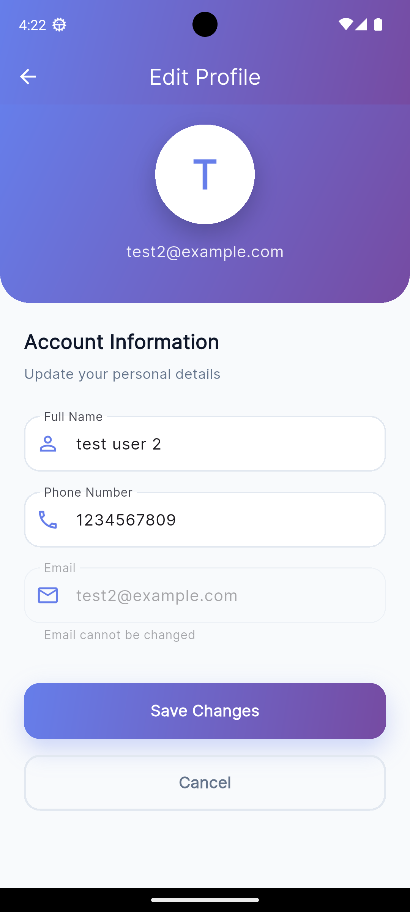
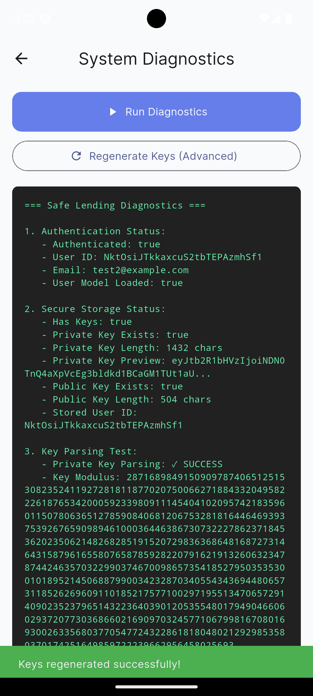

<div align="center">

# 🔐 Safe Lending

### Trustless Peer-to-Peer Lending Network (TPLN)

*A cryptographically secure informal lending system powered by RSA-2048 encryption and SHA-256 hashing*

[](https://flutter.dev)
[](https://firebase.google.com)
[](LICENSE)
[](https://github.com)

[Features](#-features) • [Screenshots](#-screenshots) • [Installation](#-installation) • [Documentation](#-documentation) • [Security](#-security)

</div>

---

## 📱 Screenshots

<div align="center">

### Splash Screen & Authentication
  

### Dashboard & Contracts
  

### Profile & Features
  

</div>

---

## ✨ Features

### 🔐 **Security First**
- **RSA-2048 Digital Signatures** - Cryptographically sign contracts
- **SHA-256 Hashing** - Ensure data integrity
- **Secure Local Storage** - Private keys never leave your device
- **Firebase Security Rules** - Server-side access control

### 💼 **Lending Made Easy**
- **Create Contracts** - Define loan terms with interest rates
- **Digital Signatures** - Both parties sign cryptographically
- **Track Repayments** - Monitor payment history
- **Contract Status** - Real-time updates (Pending, Active, Completed)

### 🎨 **Beautiful UI**
- **Animated Splash Screen** - Stunning gradient animations
- **Modern Design** - Purple-pink gradient theme
- **Smooth Transitions** - Professional animations
- **Responsive Layout** - Works on all screen sizes

### 👤 **User Management**
- **Email Authentication** - Secure Firebase Auth
- **Profile Management** - Edit your information
- **System Diagnostics** - Troubleshoot key issues
- **Audit Logs** - Track all activities

---

## 🚀 Quick Start

### Prerequisites

Before you begin, ensure you have:

- ✅ **Flutter SDK** (3.0 or higher) - [Install Guide](https://docs.flutter.dev/get-started/install)
- ✅ **Android Studio** or **VS Code** with Flutter extensions
- ✅ **Firebase Account** - [Create Free Account](https://firebase.google.com)
- ✅ **Git** - For version control

### Installation

1. **Clone the repository**
   ```bash
   git clone https://github.com/yourusername/safe-lending.git
   cd safe-lending/Safe-Lending
   ```

2. **Install dependencies**
   ```bash
   flutter pub get
   ```

3. **Configure Firebase**
   
   a. Create a Firebase project at [Firebase Console](https://console.firebase.google.com)
   
   b. Enable **Authentication** (Email/Password)
   
   c. Enable **Firestore Database**
   
   d. Download configuration files:
   - **Android**: `google-services.json` → `android/app/`
   - **iOS**: `GoogleService-Info.plist` → `ios/Runner/`
   
   e. **Create Firestore Indexes** (Important!)
   ```bash
   # Use the URLs from the app error messages or see docs/FIRESTORE_INDEX_SETUP.md
   ```

4. **Run the app**
   ```bash
   flutter run
   ```

### First Time Setup

After running the app:

1. **Register** a new account
2. **Navigate to Profile** → **System Diagnostics**
3. **Run Diagnostics** to verify cryptographic keys
4. **Create your first contract** and test signing!

---

## 📚 Documentation

Comprehensive documentation is available in the [`docs/`](docs/) folder:

| Document | Description |
|----------|-------------|
| **[START_HERE.md](docs/START_HERE.md)** | 🚀 Quick start guide and project overview |
| **[SETUP_GUIDE.md](docs/SETUP_GUIDE.md)** | 🔧 Detailed setup instructions |
| **[FIRESTORE_INDEX_SETUP.md](docs/FIRESTORE_INDEX_SETUP.md)** | 🔥 Fix "Error loading contracts" |
| **[SIGNING_FIX_SUMMARY.md](docs/SIGNING_FIX_SUMMARY.md)** | ✍️ Contract signing troubleshooting |
| **[UI_ENHANCEMENT_SUMMARY.md](docs/UI_ENHANCEMENT_SUMMARY.md)** | 🎨 UI design documentation |
| **[EDIT_PROFILE_FEATURE.md](docs/EDIT_PROFILE_FEATURE.md)** | 👤 Edit profile feature guide |
| **[TESTING_GUIDE.md](docs/TESTING_GUIDE.md)** | 🧪 Testing procedures |
| **[PROJECT_ANALYSIS.md](docs/PROJECT_ANALYSIS.md)** | 📊 Technical architecture |

**New to the project?** → Start with **[docs/START_HERE.md](docs/START_HERE.md)**

---

## 🏗️ Architecture

### Tech Stack

- **Frontend**: Flutter (Dart)
- **Backend**: Firebase (Firestore, Auth)
- **Cryptography**: RSA-2048, SHA-256
- **Storage**: Flutter Secure Storage
- **State Management**: Provider

### Project Structure

```
lib/
├── main.dart                      # App entry point
├── auth/                          # Authentication
│   ├── login_screen.dart
│   ├── register_screen.dart
│   └── auth_service.dart
├── contracts/                     # Contract management
│   ├── create_contract_screen.dart
│   ├── contract_details_screen.dart
│   ├── contracts_list_screen.dart
│   └── contract_service.dart
├── crypto/                        # Cryptography services
│   ├── rsa_service.dart          # RSA key generation & signing
│   ├── hash_service.dart         # SHA-256 hashing
│   └── signature_service.dart    # Digital signatures
├── models/                        # Data models
│   ├── user_model.dart
│   ├── contract_model.dart
│   └── repayment_model.dart
├── services/                      # Backend services
│   ├── storage_service.dart      # Secure local storage
│   └── repayment_service.dart    # Payment tracking
├── screens/                       # UI screens
│   ├── splash_screen.dart        # Animated splash
│   ├── home_screen.dart          # Dashboard
│   ├── profile_screen.dart       # User profile
│   ├── edit_profile_screen.dart  # Edit profile
│   └── diagnostics_screen.dart   # System diagnostics
└── utils/                         # Utilities
    └── constants.dart             # App constants & colors
```

---

## 🔐 Security Features

### Cryptographic Implementation

| Feature | Implementation | Purpose |
|---------|---------------|---------|
| **Digital Signatures** | RSA-2048 | Sign contracts cryptographically |
| **Data Integrity** | SHA-256 | Verify contract hasn't been tampered |
| **Key Storage** | Flutter Secure Storage | Private keys stored locally |
| **Authentication** | Firebase Auth | Secure user authentication |
| **Access Control** | Firestore Rules | Server-side authorization |

### Security Best Practices

✅ **Private keys never leave the device**  
✅ **All contracts are cryptographically signed**  
✅ **Contract hashes prevent tampering**  
✅ **Secure storage for sensitive data**  
✅ **Firebase security rules enforce access control**  

### Key Management

- **Registration**: RSA key pair generated and stored locally
- **Login**: Existing keys verified
- **Signing**: Private key used to sign contract hash
- **Verification**: Public key used to verify signatures

---

## 🎨 UI/UX Highlights

### Design System

- **Color Palette**: Modern purple-pink gradient theme
- **Typography**: Clean, readable fonts
- **Animations**: Smooth 60 FPS animations
- **Components**: Reusable, consistent design

### Key Screens

1. **Splash Screen** - Animated logo with gradient background
2. **Dashboard** - Overview of contracts and statistics
3. **Contracts** - List, create, and manage contracts
4. **Profile** - View and edit account information
5. **Diagnostics** - System health and troubleshooting

---

## 🧪 Testing

### Run Tests

```bash
# Run all tests
flutter test

# Run with coverage
flutter test --coverage
```

### Manual Testing

See [TESTING_GUIDE.md](docs/TESTING_GUIDE.md) for comprehensive testing procedures.

---

## 📦 Building

### Development Build

```bash
flutter run
```

### Release Build (Android)

```bash
flutter build apk --release
```

### Release Build (iOS)

```bash
flutter build ios --release
```

---

## 🐛 Troubleshooting

### Common Issues

| Issue | Solution |
|-------|----------|
| **"Error loading contracts"** | Create Firestore indexes - See [FIRESTORE_INDEX_SETUP.md](docs/FIRESTORE_INDEX_SETUP.md) |
| **"Failed to sign contract"** | Run diagnostics - See [SIGNING_FIX_SUMMARY.md](docs/SIGNING_FIX_SUMMARY.md) |
| **"Keys not found"** | Use Profile → System Diagnostics → Regenerate Keys |
| **Build errors** | Run `flutter clean && flutter pub get` |

### Getting Help

1. Check the [docs/](docs/) folder for detailed guides
2. Run **System Diagnostics** from Profile screen
3. Check console logs for detailed error messages
4. Review [PROJECT_STATUS.md](docs/PROJECT_STATUS.md) for known issues

---

## 🗺️ Roadmap

### ✅ Completed

- [x] User authentication system
- [x] Contract creation and management
- [x] RSA digital signatures
- [x] Repayment tracking
- [x] Beautiful UI with animations
- [x] Edit profile feature
- [x] System diagnostics tool
- [x] Comprehensive documentation

### 🚧 In Progress

- [ ] Automated testing suite
- [ ] Performance optimizations
- [ ] Dark mode support

### 📋 Planned

- [ ] Multi-language support
- [ ] Push notifications
- [ ] Contract templates
- [ ] Analytics dashboard
- [ ] Export contract PDFs
- [ ] Biometric authentication

---

## 🤝 Contributing

Contributions are welcome! Please follow these steps:

1. Fork the repository
2. Create a feature branch (`git checkout -b feature/AmazingFeature`)
3. Commit your changes (`git commit -m 'Add some AmazingFeature'`)
4. Push to the branch (`git push origin feature/AmazingFeature`)
5. Open a Pull Request

---

## 📄 License

This project is licensed under the MIT License - see the [LICENSE](LICENSE) file for details.

---

## 👥 Authors

Project Lead: Ansh Singh

---

<div align="center">

### ⭐ Star this repo if you find it helpful!
</div>
